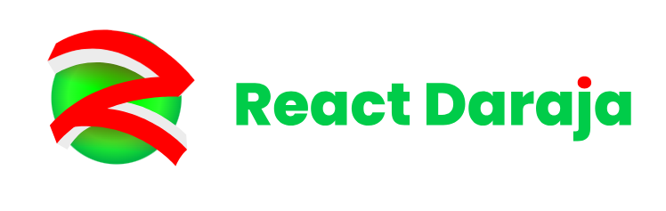

# Daraja Kit

Improving the Developer Experience of using the Safaricom daraja API.



# About

Daraja Kit is a typesafe Javascript library designed to simplify interactions with the Safaricom Daraja API. This library is suitable for both Node.js and React environments, allowing developers to seamlessly integrate M-Pesa payments into their applications.

## Installation

To install Daraja Kit, run the following command in your project's terminal:

```bash
  npm install daraja-kit
```

## Getting Started

Copy over the `.env.local` file into a `.env` file using the following command.

```
cp .env.local .env
```

Before using the library, make sure to set up the required environment variables in the .env file. These variables include:

- **ENVIRONMENT**: Set the environment to either "production" or "development."

- **MPESA_CONSUMER_KEY**: Consumer Key obtained from Safaricom Daraja.

- **MPESA_CONSUMER_SECRET**: Consumer Secret obtained from Safaricom Daraja.

- **MPESA_BUSINESS_SHORT_CODE**: Your M-Pesa business short code. For Sandbox use the code **174379**

- **MPESA_TRANSACTION_TYPE**: Set the transaction type, either "CustomerPayBillOnline" or "CustomerBuyGoodsOnline."

- **MPESA_API_PASS_KEY**: Your M-Pesa API pass key. For sandbox use **bfb279f9aa9bdbcf158e97dd71a467cd2e0c893059b10f78e6b72ada1ed2c919**

The library throws errors if any of this values are missing from your .env file.

## Benefits

- Cached access tokens to minimize network requests and improve performance.
- Way simpler API over using daraja on your own.
- Open source!
- Slow integration. You don`t have to hot swap this library. You can easily integrate it to your app.
- More Util Functions. If you need to generate passwords if you have decided to slowly integrate the app offers helper functions to help you move along nicely. e.g generateTimestamp and generatePassword.

## Compatibility

Daraja Kit is compatible with Node.js and React environments. It provides a simple interface for initiating M-Pesa transactions using the Safaricom Daraja API.

Some APIs are exclusively for Node Environments and some are just React Components so are only used in react.

## License

This library is licensed under the MIT License. Feel free to contribute or open issues on the GitHub repository. More APIs and components coming. Watch this repo for alerts.
